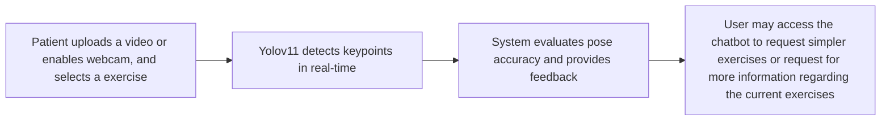

# 

## Objective
The Virtual Physiotherapy Assistant is a web-based platform that utilizes AI-powered pose estimation and chatbot support to assist patients in rehabilitation exercises. The system provides real-time feedback, and mental health support to enhance adherence and recovery

## Features
- Pose Estimation & Real-Time Feedback
  - Utilizes Yolov11 for accurate body movement tracking
  - Provides real time visual overlays and alerts user for incorrect form
- AI-Powered Physiotherapy Chatbot
  - Offers motivational support and encouragement
  - Context-aware respones tailored to user engagement
- Web-based Accessibility
  - TypeScript frontend with FastAPI backend
  - Supports real-time webcam tracking

## Technical Architecture
| Component       | Technology              |
|-----------------|-------------------------|
| Frontend        | TypeScript              |
| Backend         | FastAPI                 |
| Pose Estimation | Yolov11                 |
| Chatbot AI      | OpenAI GPT              |
| Database        | PostgreSQL              |


## System Flow


## Challenges
| Challenges             | Solution                                               |
|------------------------|--------------------------------------------------------|
| Accurate pose tracking | Adjusted the skeleton model for more accurate tracking |
| Documenting Feedback   | Utilized OpenAI for concise and clear feedback formatting                                                       |
| Early Rep Repetition Misinterpretation                       | Creating a null zone where errors would not be counted                                                    |


## Installation & Setup
1. Clone the repository
   ```
   git clone https://github.com/andrew-juang/Stride.git
   cd Stride
   ```
2. Install the dependencies
   ```
   cd web_app
   npm install
   cd ..
   pip install -r requirements.txt
   ```
3. Start the frontend development server
   ```
   npm run dev
   ```
4. Navigate to the backend and install a Postgresql database
   ```
   CREATE DATABASE stride_db;
   ```
5. Run the backend
   ```
   uvicorn backend.main:app --reload
   ```
6. Navigate to http://localhost:3000/


## Contact
For more information, please contact Andrew Juang at andrewjuang01@gmail.com
